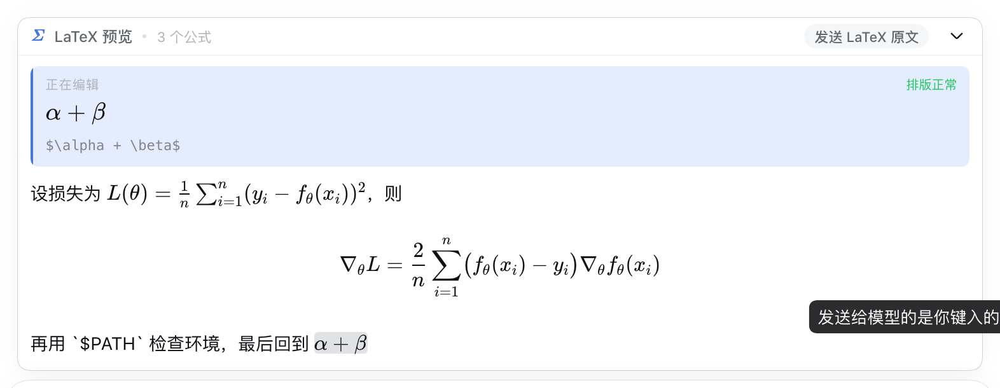

# dsh-latex-preview

English | [中文](README.zh.md)

Live LaTeX preview for the DeepSeek Harness composer. Type `$…$` in the chat box
and the formula typesets above it as you write — while the message the model
receives stays exactly the LaTeX source you typed.

Built for math-heavy conversations, where the hard part is not writing LaTeX but
*seeing* it before you commit to it.



## The one guarantee

**The preview is a lens, never a transform.** It reads the composer draft and
renders a copy; it never writes to the draft, never intercepts submission, and
never rewrites a delimiter. The verification run types a 215-character draft
containing inline math, display math and an inline code span, then asserts the
composer's text is byte-identical to what was typed.

## What it recognises

| Delimiter | Rendered as | Note |
|---|---|---|
| `$…$` | inline math | what the transcript typesets |
| `$$…$$` | display math | what the transcript typesets |
| `\(…\)` | inline math | flagged: the transcript will not typeset this |
| `\[…\]` | display math | flagged: the transcript will not typeset this |

Skipped, so a shell snippet never becomes a formula:

- fenced code blocks (``` ``` ``` / `~~~`, three or more markers)
- inline code spans (`` `…` ``, matching run length)
- escaped delimiters (`\$`)

Reported before you send:

- a formula KaTeX cannot parse — flagged in the head strip, in the document, and
  in the caret bench, with KaTeX's own message
- an unclosed delimiter, with the line it is on
- a LaTeX-native delimiter that the transcript will quietly render as plain text

## Two tracks

The panel shows the draft twice, deliberately.

**The proof** sets the whole draft the way the conversation will. This is what
catches the error a per-formula widget cannot: math that typesets fine alone but
swallows the next sentence, or a code span that should not have been math at all.

**The bench** lifts the formula your caret is inside and shows it enlarged, with
the exact source that will be sent underneath. A blue rail marks it; the same
formula carries a tint in the proof below, so your eye can hold both.

```
┌ Σ LaTeX 预览 · 3 个公式                    发送 LaTeX 原文  ⌄ ┐
├──────────────────────────────────────────────────────────────┤
│ ▎ 正在编辑                                        排版正常   │
│ ▎ α + β                                                      │
│ ▎ $\alpha + \beta$                                           │
├──────────────────────────────────────────────────────────────┤
│ 设损失为 L(θ) = 1/n Σᵢ (yᵢ − f_θ(xᵢ))²，则                    │
│                                                              │
│                  ∇_θL = 2/n Σᵢ (f_θ(xᵢ) − yᵢ)∇_θf_θ(xᵢ)      │
│                                                              │
│ 再用 `$PATH` 检查环境，最后回到 α + β                         │
└──────────────────────────────────────────────────────────────┘
```

## Sent messages

Messages you have already sent are typeset too: the formula in the bubble is shown
as it will read, not as `$…$` source.

The bubble itself is still the shell's own: its measurements, attachment cards,
clock and copy action all come from the shell's stylesheet values and exported
primitives (`projectUserText`, `FileTypeIcon`, `writeClipboard`). The only thing
this plugin adds is the math. A message with no math renders exactly as before.

**The source is never lost.** The copy action under the message still hands over
the original text verbatim, and an edit affordance — if one is added — would work
from the same source. Turn it off with "Typeset formulas in sent messages".

## Copying a formula

Selecting a typeset formula and copying writes its LaTeX source to the clipboard,
not the rendered glyphs.

The reason copying felt broken: KaTeX emits both a MathML tree (carrying the
original TeX in an `<annotation>`) and a visible HTML glyph tree, and the browser
concatenates the two when you select across them.

Four mouse gestures all come back as source:

| how you select | what lands on the clipboard |
|---|---|
| the whole formula | `$E = mc^2$` |
| **only part of a formula** | `$E = mc^2$` — half a formula has no meaning as LaTeX |
| prose, dragged across several formulas | the prose verbatim, each formula restored |
| from inside one formula into another | both formulas, whole |

The mechanism snaps the selection's boundaries out to whole formulas before
serializing: `cloneContents()` only clones an element when the boundary sits
outside it, so a boundary *inside* a formula yields a fragment of KaTeX's inner
HTML — recognisable as neither a formula nor usable text. The snapping happens on
a **copy** of the range, so what is highlighted on screen does not move, and a
selection with no math at all is left entirely to the browser.

Turn it off with "Copy formulas as LaTeX source".

## Install

```sh
dsh plugin --profile web add github:fishyu1201/dsh-latex-preview
```

The build output is committed, so a git install needs **no build step and no
`allowBuilds` permission** — pnpm never runs a script to get a working plugin.
Reload the browser tab afterwards.

To uninstall:

```sh
dsh plugin --profile web remove dsh-latex-preview
```

### Working on the plugin itself

When the plugin lives in a checkout you edit, install it through the profile's own
patch layer instead, which is the form the Harness docs give for a local plugin
("The plugin path must be absolute"):

```sh
node scripts/install.mjs            # add the row to ~/.dsh/profiles/web/cordis.patch.yml
node scripts/install.mjs --check    # report what is installed
node scripts/install.mjs --remove   # take it back out
```

This form has one practical advantage: `patchReload: live` watches patch files, so
the row applies to an already-running `dsh web`. The bundle form above is read
only at boot.

**The two forms cannot be combined.** A bundle row plus this insert produce two
loader entries with the same id, and cordis refuses to boot with
`duplicate loader entry id`. Use one or the other.

Set `DSH_PROFILE` to target another profile.

## Settings

Settings → **LaTeX 预览**:

- **启用预览** — master switch. Off renders nothing and changes nothing.
- **聚焦正在编辑的公式** — the caret bench. Off leaves the proof alone.
- **Typeset formulas in sent messages** — off returns your own messages to source.
- **Copy formulas as LaTeX source** — off restores the browser's default copy.
- **Maximum preview height (px)** — 180 / 280 / 400. Taller drafts scroll inside the
  panel rather than pushing the transcript, and the bench keeps the formula you are
  editing inside the visible band without fighting a deliberate scroll.

Preferences persist in `localStorage` under `dsh-latex-preview:prefs:v1`.

## How it works

A client-only DSH plugin. The host half exists so the loader row resolves and
`dsh.client` is discovered; it registers nothing model-facing.

- `src/client/tex.js` — pure scanner. Locates math spans by delimiter, skipping
  code, respecting escapes, and reporting unclosed openers. No DOM, no KaTeX.
- `src/client/katex-runtime.js` — typesets through KaTeX. Mirrors the transcript
  renderer's strict-then-lenient call, then treats KaTeX's own `katex-error`
  marker as a failure so the preview can report it instead of painting it.
- `src/client/caret.js` — resolves the live caret to a draft offset. Range text
  gives the offset natively; `<br>` soft breaks are counted explicitly because
  range text omits them. Every failure mode is silent: a caret that cannot be
  resolved costs the bench, never the preview.
- `src/client/dock.jsx` — the `conversation.input.dock` entry.
- `src/client/settings.jsx` — the `settings.section` entry.

Two rules keep the plugin from disturbing the app it lives in:

1. **Scoped styles.** `scripts/gen-fonts.mjs` rewrites the KaTeX stylesheet so
   every selector sits under `.lp-root` and every font family is renamed
   `LPKaTeX_*`. The transcript's own KaTeX rendering is untouched.
2. **No new dependencies at runtime.** The built `client.js` requires only
   `react` and `react/jsx-runtime`, both served from the shell's static module
   table, so the plugin shares the shell's React instance.

The 20 KaTeX woff2 faces are embedded as data URIs (~360 KB). The preview
typesets offline and does not depend on the frontend's hashed asset names, which
move between Harness releases.

## Development

```sh
npm install
npm run build     # regenerate fonts, then bundle client.js
npm test          # 40 tests: scanner units + built-bundle integration
```

`npm test` loads the built `client.js` in jsdom through the real module-loader
envelope, runs `apply()`, and renders the dock — so a broken export or a bad slot
registration fails the suite, not the browser.

### Verification in a real browser

`verify/` drives headless Chrome over CDP against a live `dsh web`, through the
shell's actual UI: dismiss the first-run modal, type a draft, read the dock back
out of the DOM.

```sh
# An isolated home, so nothing touches your real sessions.
DSH_HOME=$PWD/.verify-home dsh --profile web --port 3099 --no-open
DSH_HOME=$PWD/.verify-home node scripts/install.mjs
# Open the printed URL, then:
node verify/drive.mjs 'http://127.0.0.1:3099/?token=…'
```

It asserts the plugin is in the client module graph, that math typesets, that the
bench follows the caret, that a malformed formula is flagged, that collapsing and
the settings panel work, and — the point of the whole thing — that **the draft is
unchanged**. Screenshots land in `verify/`.

## Conformance

Audited against the published Harness docs and the shipped manifest schema: see
[CONFORMANCE.md](CONFORMANCE.md) for the field-by-field check, the three
deliberate deviations with their reasons, and what was checked and found not to
apply.

## Known limits

- **The bench needs a resolvable caret.** The input contract exposes the draft but
  not the caret, so the offset is read back out of the contenteditable. If a
  future editor build changes its DOM shape, the bench goes quiet while the proof
  keeps working.
- **The proof is not a full markdown renderer.** Headings, lists, links and
  emphasis show as plain text. Only math is typeset — that is the job.
- **`\(…\)` and `\[…\]` render but are flagged.** The transcript uses
  micromark's `$` forms; the LaTeX-native pair is shown typeset so you can proof
  it, with a standing warning that the conversation will not.

## Licence

MIT
