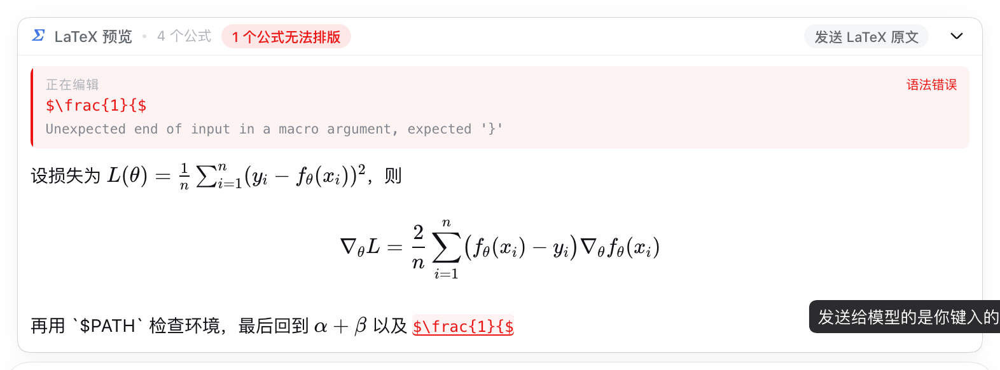
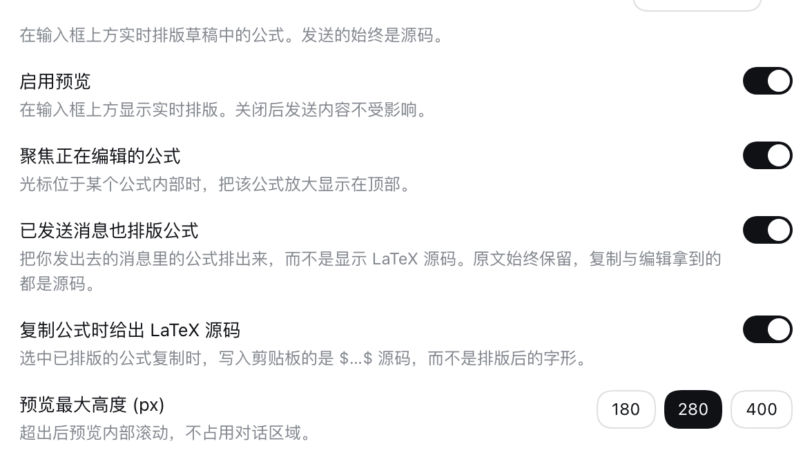

# dsh-latex-preview

[English](README.md) | 中文

DeepSeek Harness 输入框的 LaTeX 实时预览。在聊天框里键入 `$…$`，公式会在输入框上方
实时排版；而**发送给模型的，始终是你键入的 LaTeX 源码**。

为公式密集的对话而生——难点从来不是写出 LaTeX，而是在按下发送之前**看见**它。


## 唯一需要记住的保证

**预览只是一面镜子，绝不改写内容。** 它只读取草稿并渲染一份副本：不写入草稿、不拦截
发送、不替换任何分隔符。验证脚本会键入一段 215 字符、同时包含行内公式、行间公式和行内
代码的草稿，然后断言输入框中的文本与键入内容逐字节一致。

## 识别范围

| 分隔符 | 渲染为 | 说明 |
|---|---|---|
| `$…$` | 行内公式 | 对话正文也是这样排版的 |
| `$$…$$` | 行间公式 | 对话正文也是这样排版的 |
| `\(…\)` | 行内公式 | 会标注：对话正文不会把它当公式 |
| `\[…\]` | 行间公式 | 会标注：对话正文不会把它当公式 |

以下内容会被跳过，避免一段 shell 片段被误判成公式：

- 围栏代码块（``` ``` ``` / `~~~`，三个及以上）
- 行内代码（`` `…` ``，按反引号数量配对）
- 转义分隔符（`\$`）

发送前会被指出来的问题：

- KaTeX 解析失败的公式——顶部状态条、正文、聚焦台三处同时标红，并附上 KaTeX 的原始报错
- 未闭合的分隔符，并给出所在行号
- 使用了 `\[…\]` / `\(…\)` 这类不会被正文排版的分隔符

## 两条轨道

面板刻意把草稿展示两遍。

**正文轨（proof）** 把整段草稿按对话最终呈现的样子排出来。这正是"只预览单个公式"的
控件抓不到的问题：一个公式单独看没问题，却把后面一整句吞进了数学模式；或者一处本该是
代码的 `$PATH` 被当成了公式。

**聚焦台（bench）** 把光标所在的公式单独抬到顶部放大显示，下面配上即将发送的那一行原文。
左侧的蓝色竖线是它的标记，正文里同一个公式会带底色，眼睛可以同时抓住两处。

```
┌ Σ LaTeX 预览 · 3 个公式                    发送 LaTeX 原文  ⌄ ┐
├──────────────────────────────────────────────────────────────┤
│ ▎ 正在编辑                                        排版正常   │
│ ▎ α + β                                                      │
│ ▎ $\alpha + \beta$                                           │
├──────────────────────────────────────────────────────────────┤
│ 设损失为 L(θ) = 1/n Σᵢ (yᵢ − f_θ(xᵢ))²，则                    │
│                                                              │
│                  ∇_θL = 2/n Σᵢ (f_θ(xᵢ) − yᵢ)∇_θf_θ(xᵢ)      │
│                                                              │
│ 再用 `$PATH` 检查环境，最后回到 α + β                         │
└──────────────────────────────────────────────────────────────┘
```

## 已发送的消息


发出去的消息同样排版：气泡里的公式按最终呈现的样子显示，而不是 `$…$` 原文。

气泡本身仍是 shell 的排版语言——布局尺寸、附件卡片、时间与复制按钮都取自 shell 自己的
样式模块与导出原件（`projectUserText`、`FileTypeIcon`、`writeClipboard` 等），插件增加的
只有公式本身。没有公式的消息渲染结果与改动前完全一致。

**源码一字节没丢。** 消息下方的复制按钮拿到的仍是原样源码，将来若有编辑入口也应基于源码。
设置里「已发送消息也排版公式」可以关掉。

## 复制公式



选中已排版的公式复制时，写进剪贴板的是它的 LaTeX 源码，而不是排版后的字形。

原因：KaTeX 会同时输出一份 MathML（`<annotation>` 里存着原始 TeX）和一份可见的 HTML
字形树，浏览器选中时把两者一起串起来——这正是"复制出来格式异常"的来源。

四种鼠标手势都会还原成源码：

| 你怎么选 | 剪贴板拿到 |
|---|---|
| 整个公式 | `$E = mc^2$` |
| **只选中公式的一部分** | `$E = mc^2$`（半个公式没有 LaTeX 意义，给完整的那一个） |
| 从正文拖到正文、跨过若干公式 | 正文原样，公式逐个还原 |
| 从一个公式拖进另一个公式 | 两个公式都完整还原 |

做法是先把选区边界**吸附到完整公式**再序列化：`cloneContents()` 只在边界落在元素之外时
才会克隆该元素，边界落在公式**内部**时拿到的是 KaTeX 内部 HTML 的碎片，既认不出公式、又会
漏出几个字形。吸附只作用在一份**选区副本**上，所以屏幕上你选的还是原来那段——选区里没有
公式时插件完全不介入，也不会动你的选区。

设置里「复制公式时给出 LaTeX 源码」可以关掉。

## 安装

```sh
dsh plugin --profile web add github:fishyu1201/dsh-latex-preview
```

构建产物已提交进仓库，所以从 git 安装**不需要任何构建步骤，也不会触发 `allowBuilds` 授权**
——pnpm 不需要跑脚本就能拿到可用的插件。装完刷新浏览器标签页即可。

卸载：

```sh
dsh plugin --profile web remove dsh-latex-preview
```

### 在插件本身上开发

当插件放在一个你会持续修改的检出目录里时，改用 profile 自己的 patch 层安装——这是 Harness
文档给本地插件的形式（"The plugin path must be absolute."）：

```sh
node scripts/install.mjs            # 写入 ~/.dsh/profiles/web/cordis.patch.yml
node scripts/install.mjs --check    # 查看当前状态
node scripts/install.mjs --remove   # 卸载
```

这种形式有一个实际优势：`patchReload: live` 监视的是 patch 文件，所以它能作用于**已经跑着**的
`dsh web`；上面的 bundle 形式只在启动时读取。

**两种形式不能并存。** bundle 行加上这条 insert 会产生两个同 id 的 loader 条目，cordis 会直接
拒绝启动：`duplicate loader entry id`。二选一。

用 `DSH_PROFILE` 可以指定其它 profile。

## 设置

设置 → **LaTeX 预览**：

- **启用预览**——总开关。关闭后不渲染任何内容，也不影响发送。
- **聚焦正在编辑的公式**——聚焦台开关。关闭后只保留正文轨。
- **已发送消息也排版公式**——关掉后你自己的消息回到显示源码。
- **复制公式时给出 LaTeX 源码**——关掉后复制走浏览器默认行为。
- **预览最大高度 (px)**——180 / 280 / 400。超出后预览内部滚动，不会挤压对话区域；
  聚焦台会把正在编辑的公式保持在可视范围内，但不会和你主动的滚动较劲。



偏好保存在 `localStorage` 的 `dsh-latex-preview:prefs:v1`。

## 实现

纯客户端插件。host 半边只为让 loader 行能解析、并让 `dsh.client` 被发现，不注册任何面向
模型的东西。

- `src/client/tex.js`——纯扫描器。按分隔符定位公式，跳过代码、处理转义、报告未闭合的开
  分隔符。不碰 DOM，不碰 KaTeX。
- `src/client/katex-runtime.js`——用 KaTeX 排版。调用顺序与正文渲染器一致（先严格后宽松），
  再把 KaTeX 自己的 `katex-error` 标记判定为失败，从而"报告错误"而不是"把错误画出来"。
- `src/client/caret.js`——把实时光标位置换算成草稿偏移。Range 文本天然给出偏移；`<br>`
  软换行被单独计数，因为 Range 文本会漏掉它。所有失败都是静默的：定位不到光标只会失去
  聚焦台，不会影响预览。
- `src/client/dock.jsx`——`conversation.input.dock` 条目。
- `src/client/settings.jsx`——`settings.section` 条目。

两条规则保证插件不会打扰它寄居的应用：

1. **样式完全隔离。** `scripts/gen-fonts.mjs` 会重写 KaTeX 样式表，让所有选择器都落在
   `.lp-scope` 之下，并把字体族改名为 `LPKaTeX_*`。对话正文自己的 KaTeX 渲染不受影响。
2. **运行时不引入新依赖。** 构建产物 `client.js` 只 require `react`、`react/jsx-runtime` 和
   `@deepseek-ai/dsh-client-ui-primitives`——三者都由 shell 的静态模块表提供，因此插件与 shell
   共用同一个 React 实例和同一套控件，而不是各带一份副本。

20 个 KaTeX woff2 字体以 data URI 内嵌（约 360 KB）。预览可以离线排版，也不依赖前端那些
会随版本变化的资源哈希名。

## 开发

```sh
npm install
npm run build     # 重新生成字体，然后打包 client.js
npm test          # 57 个测试：扫描器单测、复制序列化、构建产物集成
```

`npm test` 会把构建好的 `client.js` 放进 jsdom，走真实的模块加载信封执行，跑 `apply()`，
再渲染 dock——所以导出写错或插槽注册失败会挂在测试里，而不是挂在浏览器里。

### 真实浏览器验证

`verify/` 通过 CDP 驱动 headless Chrome，对着真实的 `dsh web` 走一遍 shell 的实际 UI：
关掉首次运行的弹窗、键入草稿、再把 dock 从 DOM 里读回来。

```sh
# 用独立的 home，完全不碰你自己的会话
DSH_HOME=$PWD/.verify-home dsh --profile web --port 3099 --no-open
DSH_HOME=$PWD/.verify-home node scripts/install.mjs
# 打开打印出来的 URL，然后：
node verify/drive.mjs 'http://127.0.0.1:3099/?token=…'
```

它会断言：插件出现在客户端模块图里、公式真的排版了、聚焦台跟着光标走、写坏的公式被标红、
共享的 `ui-primitives` 控件确实渲染了、悬停徽标会弹出 shell 自己的 tooltip、折叠和设置面板可用
——以及最关键的——**草稿没有被改动**。截图输出到 `verify/`。

## 规范符合性

已对照官方文档与随安装附带的清单 schema 完成审计：逐字段的核对结果、三处有意保留的偏离
及其理由、以及核过之后确认不适用的项，都写在 [CONFORMANCE.zh.md](CONFORMANCE.zh.md)。

## 已知限制

- **聚焦台依赖可解析的光标。** 输入契约只暴露草稿、不暴露光标，所以偏移是从
  contenteditable 里读回来的。如果未来的编辑器改动 DOM 结构，聚焦台会安静地失效，而正文
  轨照常工作。
- **正文轨不是完整的 markdown 渲染器。** 标题、列表、链接、强调都按纯文本显示。这里只
  排版数学——这就是它的职责。
- **`\(…\)` 和 `\[…\]` 会渲染但带标注。** 对话正文用的是 micromark 的 `$` 形式；这两种
  LaTeX 原生写法照样排出来供你校对，同时常驻一条"正文不会排版它"的提示。

## 许可

MIT
